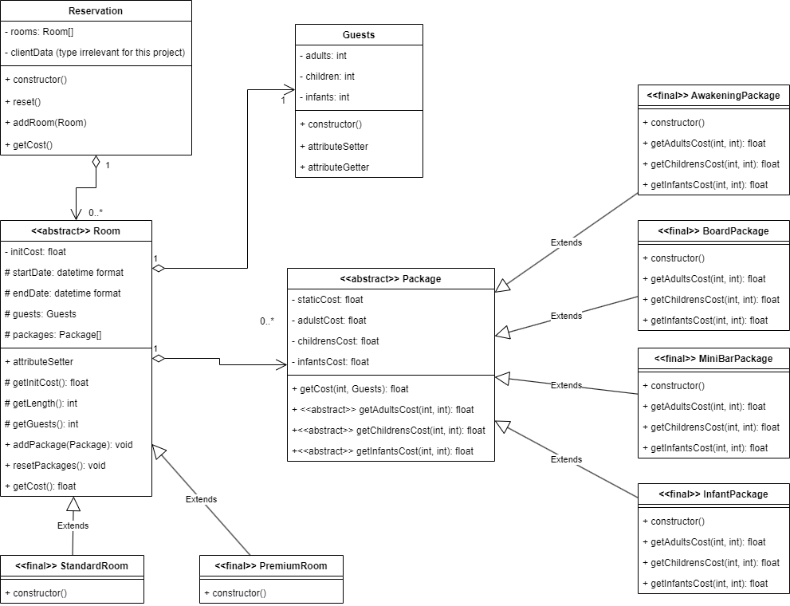

# Technologie programowania - Zadanie praktyczne



<br />

### Pseudokod:

* Reservation

```
class Reservation:
    # Attributes
    prviate (ClientDataType) clientData
    private list <Room> rooms


    # Methods
    public constructor():
        pass

    public reset():
        this.rooms = list.empty <Room>

    public addRoom(Room room):
        this.rooms.add(room)

    public getCost():
        float total = 0.0
        for each room in this.rooms:
            total += room.getCost()
        return total
```

<br />
<br />
<br />

* Rooms - factory 

> Open-closed principle: klasa `Room` jest otwarta na rozbudowę poprzez dodawanie nowych klas dziedziczących

> **Factory method:** TODO

```
abstract class Room:
    # Attributes
    private float initCost
    protected datetime startDate
    protected datetime endDate
    protected Guests guest
    protected list <Package> packages


    # Methods
    protected float getInitCost (string roomType):
        # Fetches an initial room cost from a specified source, e.g.
        # database, application config files
        return fetchInitCost(roomType)

    protected int getLength():
        return int(this.endDate - this.startDate)

    protected int getGuests():
        return this.guests.get(adults) + this.guests.get(children)

    public void addPackage(Package package):
        this.packages.add(package)

    public void resetPackages():
        this.packages = list.empty <Package>

    public float getCost():
        float total = this.initCost
        for each package in this.packages:
            total += package.getCost()
        return total
```

<br />

```
final class StandarRoom extends Room:
    public constructor():
        this.initCost = this.getInitCost(this.getClassName())


final class PremiumRoom extends Room:
    public constructor():
        this.initCost = this.getInitCost(this.getClassName())
```

<br />
<br />
<br />

* Packages - template method

> Open-closed principle: klasa `Package` jest otwarta na rozbudowę poprzez dodawanie nowych klas dziedziczących

> **Template method:** Zakładając, że każdy pakiet można rozbić na:
> 
> * Kosz statyczny - niezależny od liczby gości ani czasu pobytu
> * Koszt dorosłych - zależny od liczby dorosłych i opcjonalnie od czasu pobytu
> * Koszt dzici - zależny od liczby dzieci i opcjonalnie od czasu pobytu
> * Koszt małych dzieci - zależny od liczby małych dzieci i opcjonalnie od czasu pobytu
> 
> Koszt dowolnego pakiety można obliczyć jako sumę wyżej wymienionych kosztów, zatem implementacja takiego wzorca znajduje się w metodzie `Package::getCost()`, a obliczanie każdego z poszczególnych kosztów jest implementowane w klasach dziedziczących po klasie `Package`

```
abstract class Package:
    # Attributes
    private float staticCost
    private float adultsCost
    private float childrensCost
    private float infantsCost


    # Methods
    public getCost(int length, Guests guests):
        return this.staticCost +
               this.getAdultsCost(length, guests.get(adults)) +
               this.getChildrensCost(length, guests.get(children)) +
               this.getInfantsCost(length, guests.get(infants))

    public abstract getStaticCost()
    public abstract getAdultsCost(int length, int adults)
    public abstract getChildrensCost(int length, int children)
    public abstract getInfantsCost(int length, int infants)
```

<br />

```
final class AwakeningPackage extends Package:
    public constructor:
        # Fetches the package cost values from a specified source, e.g.
        # database, application config files
        this.staticCost = fetchCost(static, this.getClassName())
        this.adultsCost = fetchCost(adult, this.getClassName())
        this.childrensCost = fetchCost(child, this.getClassName())
        this.infantsCost = fetchCost(infant, this.getClassName())

    @override 
    getAdultsCost(int length, int adults):
        return 0.0

    @override 
    getChildrensCost(int length, int children):
        return 0.0

    @override 
    getInfantsCost(int length, int infants):
        return 0.0
```

```
final class BoardPackage extends Package:
    public constructor:
        # Fetches the package cost values from a specified source, e.g.
        # database, application config files
        this.staticCost = fetchCost(static, this.getClassName())
        this.adultsCost = fetchCost(adult, this.getClassName())
        this.childrensCost = fetchCost(child, this.getClassName())
        this.infantsCost = fetchCost(infant, this.getClassName())

    @override 
    getAdultsCost(int length, int adults):
        return length * adults * this.adultsCost

    @override 
    getChildrensCost(int length, int children):
        return length * adults * this.childrensCost

    @override 
    getInfantsCost(int length, int infants):
        return 0.0
```

```
final class MiniBarPackage extends Package:
    public constructor:
        # Fetches the package cost values from a specified source, e.g.
        # database, application config files
        this.staticCost = fetchCost(static, this.getClassName())
        this.adultsCost = fetchCost(adult, this.getClassName())
        this.childrensCost = fetchCost(child, this.getClassName())
        this.infantsCost = fetchCost(infant, this.getClassName())

    @override 
    getAdultsCost(int length, int adults):
        return adults * this.adultsCost

    @override 
    getChildrensCost(int length, int children):
        return 0.0

    @override 
    getInfantsCost(int length, int infants):
        return 0.0
```

```
final class InfantPackage extends Package:
    public constructor:
        # Fetches the package cost values from a specified source, e.g.
        # database, application config files
        this.staticCost = fetchCost(static, this.getClassName())
        this.adultsCost = fetchCost(adult, this.getClassName())
        this.childrensCost = fetchCost(child, this.getClassName())
        this.infantsCost = fetchCost(infant, this.getClassName())

    @override 
    getAdultsCost(int length, int adults):
        return 0.0

    @override 
    getChildrensCost(int length, int children):
        return 0.0

    @override 
    getInfantsCost(int length, int infants):
        return infants * this.infantsCost
```